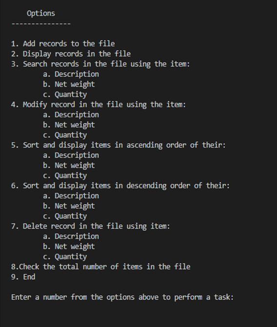

# Upon learning how to write into a `.txt` file, i decided to work on a program that helps mini stores keep track of items, with their respective description, net weight, and quantity available

# Various tasks can be done such as:
*

# Here is a sneak peak into the program
![Alt Text] (Screenshots/screenshot_1.png)
![Alt Text] (Screenshots/screenshot_2.png)
![Alt Text] (Screenshots/screenshot_3.png)
