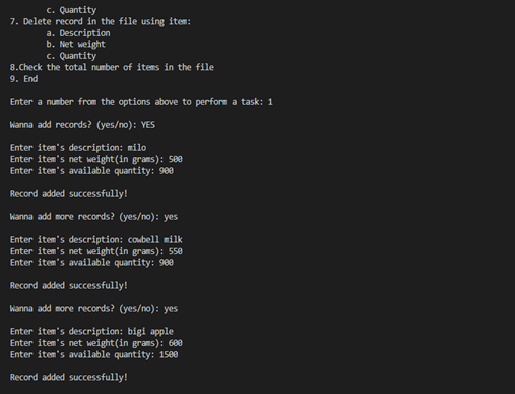
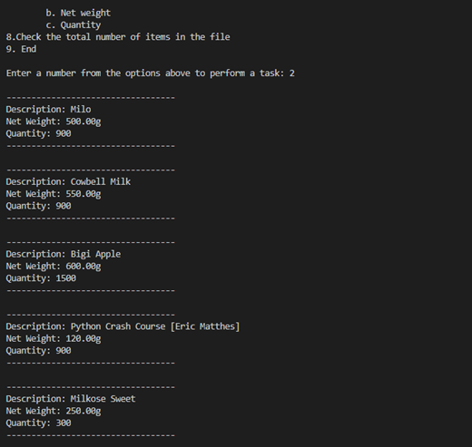
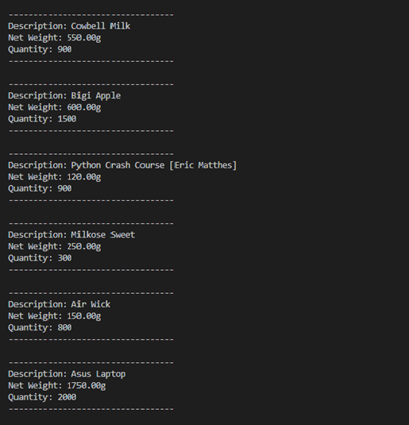

# Item Tracker for Mini Stores

This is a program that assists micro stores in keeping track of the things they have in stock, as well as their descriptions, net weights, and quantities.

# Requirements

There are no requirements; all you have to do is run the script. If you don't already have Python installed, you can get it from [here](https://www.python.org/downloads/).

# How to run the script

To run the script, open a terminal in the folder where your script is located and run the following command 

`python main.py`

# Various tasks can be done such as

# Here is a sneak peak into the program

